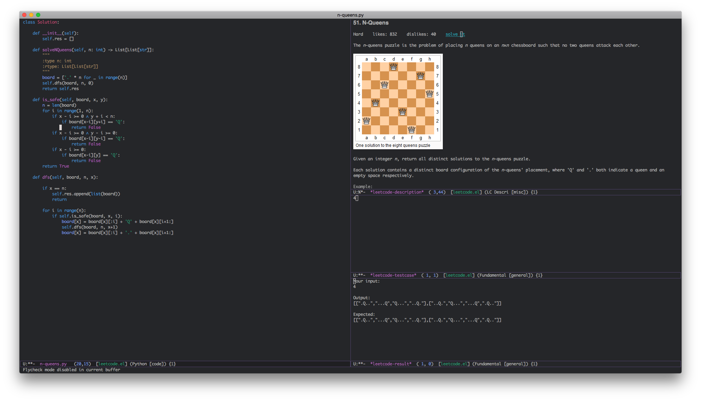

# Introduction

LeetCode brings you offer, and now Emacs brings you LeetCode!

# Dependencies

## Emacs Library

- dash.el
- request.el
- request-deferred.el
- graphql.el
- spinner.el

## External software

- cURL

# Installation

1. Clone this repository
2. Move it to your load-path
3. Require it in your emacs config

# Configuration

You need to set your LeetCode account and password:

```elisp
(setq leetcode-account "your-account")
(setq leetcode-password "your-password")
```

Put password into your emacs config is not a good idea, you may want to read
your password from somewhere else.

You can also set your LeetCode programming language by setting
`leetcode-prefer-language`:

```elisp
(setq leetcode-prefer-language "python3")
```

# Usage

1.  Execute `leetcode` command


In leetcode problems list buffer:

| keymap | command                          |
|--------|----------------------------------|
| n      | cursor move down                 |
| p      | cursor move up                   |
| RET    | show current problem description |

2. Press `<RET>`, show problem description, move cursor to 'solve it', press
   `<RET>` again, start coding!

3. After finishing your code, execute `leetcode-submit`.


